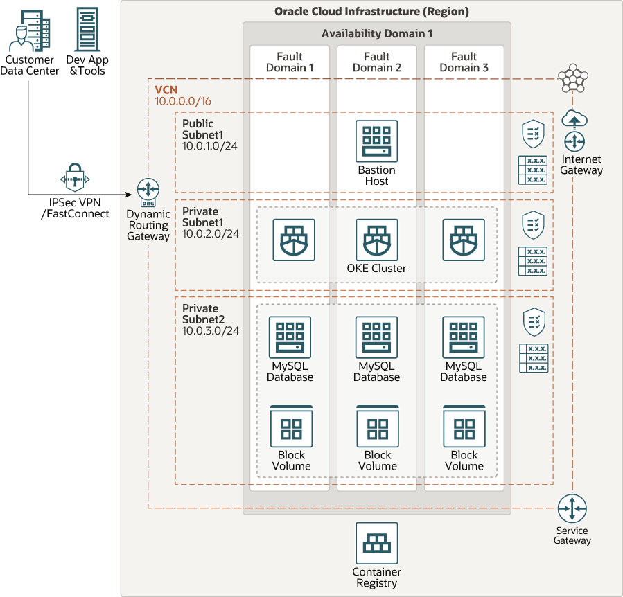

# terraform-oci-arch-oke-mds

Oracle Cloud Infrastructure Container Engine for Kubernetes is a fully-managed, scalable, and highly available service that you can use to deploy your containerized applications to the cloud. Use Container Engine for Kubernetes (sometimes abbreviated to just OKE) when your development team wants to reliably build, deploy, and manage cloud-native applications. 

Oracle MySQL Database Service is a fully managed database service that lets developers quickly develop and deploy secure, cloud native applications using the world’s most popular open source database. MySQL Database Service is the only MySQL cloud service with an integrated, high performance, in-memory query accelerator—HeatWave.

For details of the architecture, see [_Deploy Cloud Native Apps that use MySQL to Oracle Cloud Infrastructure_](https://docs.oracle.com/en/solutions/cloud-native-mysql-oci/index.html)

## Architecture Topology Diagram



## Prerequisites

- Permission to `manage` the following types of resources in your Oracle Cloud Infrastructure tenancy: `vcns`, `internet-gateways`, `route-tables`, `security-lists`, `subnets`, `mysql-family`, and `instances`.

- Policy on OCI tenancy root compartment level to allow OKE to manange the resources: `allow service OKE to manage all-resources in tenancy`.
 
- Quota to create the following resources: 1 VCN, 5 subnets, 1 Internet Gateway, 1 NAT Gateway, 3 route rules, 1 MySQL Database Instance, 1 Compute Instance (BastionVM) and 1 OKE Cluster with 3 worker nodes.

If you don't have the required permissions and quota, contact your tenancy administrator. See [Policy Reference](https://docs.cloud.oracle.com/en-us/iaas/Content/Identity/Reference/policyreference.htm), [Service Limits](https://docs.cloud.oracle.com/en-us/iaas/Content/General/Concepts/servicelimits.htm), [Compartment Quotas](https://docs.cloud.oracle.com/iaas/Content/General/Concepts/resourcequotas.htm).

## Deploy Using Oracle Resource Manager

1. Click [](https://cloud.oracle.com/resourcemanager/stacks/create?region=home&zipUrl=https://github.com/oracle-devrel/terraform-oci-arch-oke-mds/releases/latest/download/terraform-oci-arch-oke-mds-stack-latest.zip)

    If you aren't already signed in, when prompted, enter the tenancy and user credentials.

2. Review and accept the terms and conditions.

3. Select the region where you want to deploy the stack.

4. Follow the on-screen prompts and instructions to create the stack.

5. After creating the stack, click **Terraform Actions**, and select **Plan**.

6. Wait for the job to be completed, and review the plan.

    To make any changes, return to the Stack Details page, click **Edit Stack**, and make the required changes. Then, run the **Plan** action again.

7. If no further changes are necessary, return to the Stack Details page, click **Terraform Actions**, and select **Apply**. 

## Deploy Using the Terraform CLI

### Clone the Module
Now, you'll want a local copy of this repo. You can make that with the commands:

    git clone https://github.com/oracle-devrel/terraform-oci-arch-oke-mds.git
    cd terraform-oci-arch-oke-mds
    ls

2. Create a `terraform.tfvars` file, and specify the following variables:

```
# Authentication
tenancy_ocid         = "<tenancy_ocid>"
user_ocid            = "<user_ocid>"
fingerprint          = "<finger_print>"
private_key_path     = "<pem_private_key_path>"

# Region
region = "<oci_region>"

# Compartment
compartment_ocid = "<compartment_ocid>"

# database
admin_password   = "<mds_admin_password>"

````

### Create the Resources
Run the following commands:

    terraform init
    terraform plan
    terraform apply

### Destroy the Deployment
When you no longer need the deployment, you can run this command to destroy the resources:

    terraform destroy


